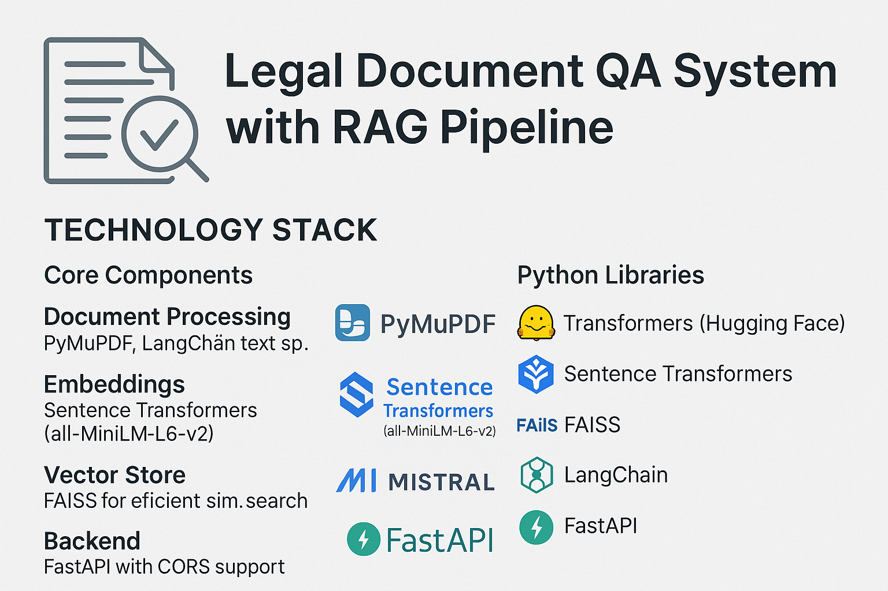
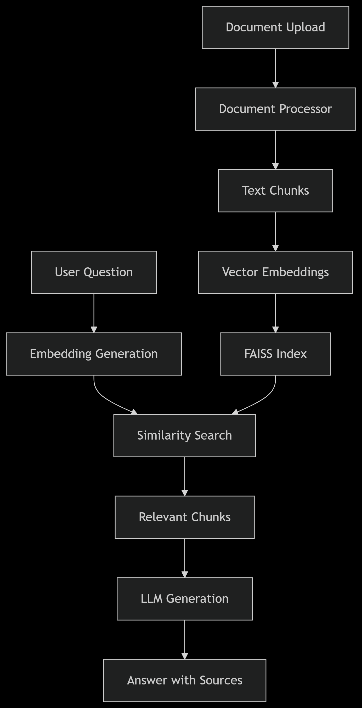

# Legal Document QA System with RAG Pipeline

### An intelligent Legal Assistant that uses **Retrieval-Augmented Generation (RAG)** to answer queries based on uploaded legal documents (PDF/TXT). This project combines document parsing, semantic search, and large language models (LLMs) to provide context-aware legal answers, along with document references.

 *(placeholder image)*

## Problem Statement

Legal professionals often spend excessive time searching through lengthy documents to find specific clauses, precedents, or answers to legal questions. This system aims to automate that process by:

1. Processing various legal document formats (PDFs, text files)
2. Creating a searchable knowledge base
3. Providing accurate answers to natural language questions
4. Citing relevant sources from the documents

## Solution Overview

This project implements a Retrieval-Augmented Generation (RAG) pipeline that:

- Processes and chunks legal documents
- Creates vector embeddings for semantic search
- Uses a large language model (Mistral-7B) to generate precise answers
- Provides source citations for verification

## Key Features

- **Document Processing**: Handles PDFs and text documents with proper text extraction and cleaning
- **Semantic Search**: Finds relevant document chunks using FAISS vector similarity
- **Precise QA**: Generates accurate answers with citations using Mistral-7B
- **API Endpoints**: FastAPI backend for easy integration
- **Persistent Storage**: Saves processed documents for future queries

## 🚀 Demo & Capabilities

- Upload legal PDFs or text files.
- Ask legal questions in natural language.
- Receive AI-generated answers grounded in the uploaded documents.
- View sources (document name, page number, similarity score) for transparency.
- REST API built with FastAPI for easy integration.

## 🧰 Tech Stack

| Component            | Technology                              |
|---------------------|------------------------------------------|
| Document Parsing     | PyMuPDF, LangChain TextLoader            |
| Chunking             | RecursiveCharacterTextSplitter           |
| Embeddings           | SentenceTransformers (MiniLM)            |
| Vector Store         | FAISS                                    |
| LLM                  | Mistral-7B-Instruct via HuggingFace      |
| Backend/API          | FastAPI                                  |
| Interface            | REST API (JSON requests/responses)       |
| Deployment Ready     | Uvicorn, CORS-enabled backend            |

### Python Libraries
- Transformers (Hugging Face)
- Sentence Transformers
- FAISS
- LangChain
- FastAPI
### 📚 Learning Outcomes
✅ Practical implementation of the Retrieval-Augmented Generation pipeline.

✅ Hands-on with FAISS and SentenceTransformers for dense semantic search.

✅ Integrated large-scale language models (Mistral-7B) into a production pipeline.

✅ Designed a scalable and modular architecture for document QA.

✅ Built a developer-friendly backend using FastAPI with CORS and error handling.

### 🔧 Future Improvements
- Add a Streamlit or React front-end interface.
- Support for more document types (.docx, HTML).
- GPU-optimized Docker deployment.
- Improve answer citation with exact context locations.
- Add authentication & document-specific access control.

  

